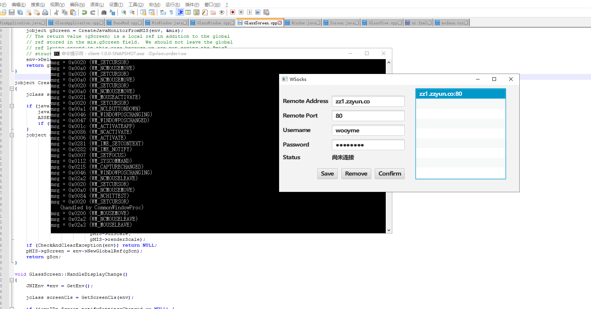

JavaFX Native Image Demo
====================
# If GluonVM's plugin bas supported building native image on windows, this repo is no longer useful.



# Before Build
* openJDK8
* Graalvm version 19.1.1 (ee)
* OpenJFX (https://github.com/Wooyme/openjdk-jfx-with-tray)

## For Windows

### OpenJFX Part
>You will need Windows 7 or later (Windows 10 is recommended) 64-bit OS
>
>You need to have the following tools installed:
>
>Cygwin. Some packages to make sure are installed are:  
>mercurial (hg)  
>openssh  
>zip  
>unzip  
>make (needed to compile media)  
>makedepend (needed for media)  
>Microsoft Visual Studio 2017, either Professional or Community edition. The Desktop development with C++ workload is required at most, but it may be possible to install individual components to satisfy the requirements.
Microsoft DirectShow header files – If you build media you will need the DirectShow header files from the Microsoft Windows SDK v7.1, installed in its default location of "C:\Program Files\Microsoft SDKs\Windows\v7.1".

### Native image Part
>https://github.com/oracle/graal/issues/1258#issuecomment-491325870

## For Linux

>Ubuntu 18.04
First, run the following command to install all the required development packages:
```
sudo apt-get update
sudo apt-get install libavformat-ffmpeg57 libgl1-mesa-dev \
    libx11-dev pkg-config x11proto-core-dev mercurial git \
    libgtk2.0-dev libgtk-3-dev
```

>If you build WebKit (it is not built by default) you will need the following additional tools:

>Cmake 3.13.3 or later, available from the Cmake download site  
>bison  
>flex  
>gperf  
>ruby  
>The following should satisfy the requirements (but check the version of cmake) :
```
sudo apt-get install cmake bison flex gperf ruby
```
>Oracle Enterprise Linux 7 and Fedora 21  
We use Oracle Linux 7 to build the javafx.* modules that we ship with the Oracle JDK releases. Here are the packages you will need:
```
yum install mercurial git bison flex gperf pkgconfig \
    gtk2-devel gtk3-devel pango-devel freetype-devel
```

# Build OpenJFX

1. clone from  https://github.com/Wooyme/openjdk-jfx-with-tray.git
2. and follow https://wiki.openjdk.java.net/display/OpenJFX/Building+OpenJFX

# Build Demo
```
mvn clean package
```

# Build Native Image

## For Linux
```
cd build-linux
cp -r * ../
cd ..
./build-native-image
```
**Make sure u have enough memory(at least 4G free memory)**

After build, u will get `Client`.   
U may need to add `-Djava.library.path=PATH_TO_LIBRARY`(all library files are in path_to_openjfx_source/build/sdk/rt/lib/amd64) to run the demo, so that program can find the pipeline.

## For Windows
Graalvm's windows version is still an  EAP, so it's **so fucking  uncertain**

1. copy all files in build-win to the main directory.
2. run build.bat in `Windows SDK 7.1 Command Prompt`
3. At the end of building, u will get some error.
4. go to the temp directory `C:\Users\YOUR_USERNAME\\AppData\Local\Temp\4\SVM-XXXXX`. (I'm not sure is the number of 4 certain, but u can easily find such a directory, I think.)
5. after found the newest directory start with SVM and u will see xxxxxx.tmp in it. just rename it to xxxxxx.obj and copy the directory name.
6. replace the old one in `link.bat` and run it. (The reason why link.bat works is that I added the argument of `/FORCE:UNRESOLVED`)
7. If everything is right, u will get the executable file.
8. U also need to assign `java.library.path` which is `path_to_openjfx_source/build/sdk/rt/bin`
9. Because of some bug, u need to add some other arguments to disable some native features. ` -Dprism.order=sw -Dprism.nativepisces=false -Dprism.allowhidpi=false -Dprism.text=t2k`
10. font_t2k is from oraclejdk, so u need to copy javafx_font_t2k.dll from graalvm ee to ur java.library.path. (It's may illegal,but who cares.)
11. U will see the window and the black console window  if nothing wrong. To avoid open the console, u need to compile `main.cpp` and start from it.
